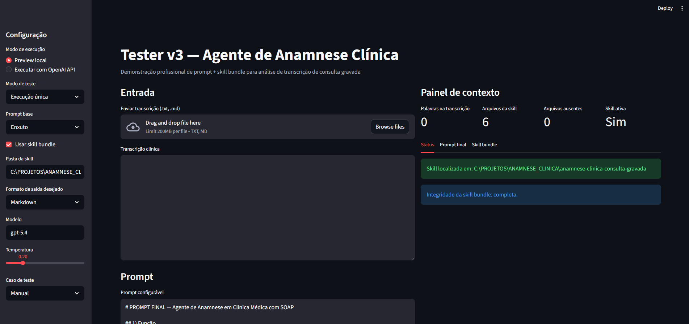

# README — Como rodar o projeto de teste do Agente de Anamnese Clínica




Este guia foi escrito para uma pessoa **leiga**, sem experiência prévia com programação.

O objetivo é ajudar você a:

1. baixar os arquivos;
2. instalar o que for necessário;
3. abrir o projeto no computador;
4. rodar a aplicação;
5. entender o que está vendo na tela;
6. testar com ou sem conexão com a API.

---

# 1. O que é este projeto

Este projeto é uma **aplicação de teste** feita em **Python + Streamlit**.

Ela serve para demonstrar um agente que:

- recebe a **transcrição de uma consulta médica gravada**;
- organiza essa transcrição;
- produz uma **anamnese estruturada**;
- sugere **hipóteses diagnósticas**, **red flags**, **limitações** e **SOAP final**.

A aplicação também consegue:

- carregar uma **skill bundle**;
- comparar resultados **com skill vs sem skill**;
- comparar **prompt enxuto vs prompt completo**;
- exportar o resultado em **Markdown** e **JSON**.

---

# 2. Arquivos que devem estar juntos

Crie uma pasta no seu computador, por exemplo:

```text
Projeto_Anamnese
```

Dentro dessa pasta, coloque estes arquivos:

```text
Projeto_Anamnese/
├── app_v3.py
└── create_skill_bundle.py
```

Depois de rodar um dos comandos explicados mais abaixo, a pasta ficará assim:

```text
Projeto_Anamnese/
├── app_v3.py
├── create_skill_bundle.py
└── anamnese-clinica-consulta-gravada/
    ├── SKILL.md
    ├── README.md
    ├── references/
    │   ├── red_flags_gerais.md
    │   ├── estrutura_soap.md
    │   └── principios_grounding_clinico.md
    └── assets/
        └── template_saida.md
```

---

# 3. O que você precisa instalar

Você precisa de 2 coisas no computador:

## A. Python
O Python é a linguagem usada para rodar o projeto.

## B. Bibliotecas do projeto
Depois que o Python estiver instalado, você vai instalar:

- `streamlit`
- `openai`

---

# 4. Como instalar o Python

## No Windows

1. Entre no site oficial do Python.
2. Baixe a versão mais recente do Python 3.
3. Durante a instalação, **marque a opção**:

```text
Add Python to PATH
```

Isso é muito importante.

4. Termine a instalação.

## Como conferir se deu certo no Windows

Abra o **Prompt de Comando** e digite:

```bash
python --version
```

Se aparecer algo como:

```text
Python 3.11.x
```

está tudo certo.

---

## No macOS

1. Instale o Python 3.
2. Depois abra o **Terminal** e teste:

```bash
python3 --version
```

Se aparecer a versão, está ok.

---

# 5. Como abrir a pasta do projeto no terminal

## No Windows

1. Coloque a pasta do projeto, por exemplo, em:

```text
C:\PROJETOS\Projeto_Anamnese
```

2. Abra o Prompt de Comando.
3. Vá até a pasta usando:

```bash
cd C:\PROJETOS\Projeto_Anamnese
```

---

## No macOS

Supondo que a pasta esteja em Documentos:

```bash
cd ~/Documents/Projeto_Anamnese
```

---

# 6. Como instalar as bibliotecas do projeto

Dentro da pasta do projeto, rode:

## Windows

```bash
pip install streamlit openai
```

## macOS
Se `pip` não funcionar, tente:

```bash
pip3 install streamlit openai
```

ou:

```bash
python3 -m pip install streamlit openai
```

---

# 7. Como criar a pasta da skill

Antes de abrir a aplicação, rode este comando:

## Windows

```bash
python create_skill_bundle.py
```

## macOS

```bash
python3 create_skill_bundle.py
```

Esse comando cria automaticamente a pasta:

```text
anamnese-clinica-consulta-gravada
```

com todos os arquivos da skill necessários.

Se tudo der certo, você verá uma mensagem parecida com:

```text
Skill criada em: ...
```

---

# 8. Como abrir a aplicação

Depois de criar a skill, rode:

## Windows

```bash
streamlit run app_v3.py
```

## macOS

```bash
python3 -m streamlit run app_v3.py
```

Quando esse comando rodar, o navegador deve abrir sozinho.

Se não abrir, o terminal normalmente mostra um endereço como este:

```text
http://localhost:8501
```

Basta copiar e colar esse endereço no navegador.

---

# 9. Como usar a aplicação

Quando a tela abrir, você verá:

- um painel lateral com configurações;
- uma área para colar ou subir a transcrição;
- uma área mostrando o prompt;
- uma área mostrando a skill carregada;
- botões para executar os testes.

---

# 10. Modo mais fácil para testar primeiro

Se a pessoa nunca mexeu com API, faça assim:

## Passo 1
No menu lateral, escolha:

```text
Modo de execução = Preview local
```

Esse modo **não usa API** e **não gasta créditos**.

Ele serve para mostrar:

- se a skill foi carregada;
- se o prompt foi montado corretamente;
- se a interface está funcionando.

## Passo 2
No menu lateral, escolha um caso de teste pronto.

Exemplos:

- Dispneia com ortopneia e edema
- Dor abdominal com lacunas
- Cefaleia com transcrição imperfeita
- Seguimento multimorbidade

## Passo 3
Clique em:

```text
Executar teste
```

---

# 11. Como testar com resposta real da API

Para a aplicação gerar uma resposta real do modelo, é preciso ter uma **chave da OpenAI**.

## O que é a chave
É um código secreto da sua conta OpenAI.

Ela começa normalmente com algo parecido com:

```text
sk-...
```

## Como usar a chave no Windows

No Prompt de Comando, antes de abrir o app, rode:

```bash
set OPENAI_API_KEY=sua_chave_aqui
```

Depois rode:

```bash
streamlit run app_v3.py
```

## Como usar a chave no macOS

No Terminal:

```bash
export OPENAI_API_KEY="sua_chave_aqui"
```

Depois rode:

```bash
python3 -m streamlit run app_v3.py
```

## Depois disso, dentro do app

No menu lateral:

```text
Modo de execução = Executar com OpenAI API
```

Aí clique em:

```text
Executar teste
```

---

# 12. Configurações mais importantes da tela

## A. Modo de execução

### Preview local
- não usa API;
- não gera resposta real do modelo;
- serve para validar a estrutura.

### Executar com OpenAI API
- usa a chave da OpenAI;
- gera resposta real;
- ideal para demonstração do comportamento do agente.

---

## B. Modo de teste

### Execução única
Roda um cenário só.

### Comparar com skill vs sem skill
Mostra lado a lado:
- uma execução sem skill;
- uma execução com skill.

Isso ajuda a visualizar o efeito da skill.

### Comparar prompt enxuto vs completo
Mostra lado a lado:
- prompt menor;
- prompt maior.

Isso ajuda a comparar estratégias.

---

## C. Prompt base

Você pode escolher:

- **Enxuto**
- **Completo**

Se não quiser mexer nisso, deixe como está.

---

## D. Pasta da skill

O caminho normalmente deve apontar para:

```text
anamnese-clinica-consulta-gravada
```

Se você rodou `create_skill_bundle.py` na mesma pasta do projeto, normalmente isso já aparece preenchido automaticamente.

---

## E. Formato de saída

Você pode escolher:

- **Markdown**
- **JSON**

Para uma pessoa leiga, **Markdown** costuma ser mais fácil de ler.

---

## F. Modelo

O campo modelo vem preenchido.

Se você não souber mudar, deixe como está.

---

## G. Temperatura

Controla o grau de variação na resposta do modelo.

Para testes clínicos estruturados, valores baixos funcionam melhor.

Se não souber mexer, deixe:

```text
0.2
```

---

# 13. Como entender se deu certo

Se tudo estiver funcionando, você verá sinais como:

- mensagem dizendo que a skill foi localizada;
- quantidade de arquivos da skill carregados;
- o prompt final composto aparecendo;
- uma saída do agente ou do preview;
- um checklist automático.

---

# 14. O que significa o checklist

O sistema verifica automaticamente se a saída contém pontos importantes, como:

- **Impressão Clínica**
- **Hipóteses diagnósticas**
- **Red flags**
- **Limitações**
- **SOAP final**
- **Marcação de ausências/lacunas**

Se aparecer:

```text
✅
```

significa que aquele item foi encontrado.

Se aparecer:

```text
⚠️
```

significa que aquele item não foi detectado automaticamente.

Importante: esse checklist é simples e automático. Ele ajuda, mas não substitui avaliação humana.

---

# 15. Como exportar o resultado

Depois de rodar um teste, a aplicação permite baixar o resultado em:

- **Markdown**
- **JSON**

Isso é útil para:

- guardar exemplos;
- comparar versões;
- enviar para avaliação;
- montar documentação do projeto.

---

# 16. Problemas comuns e como resolver

## Problema 1 — “Nenhum arquivo da skill encontrado”
### Causa
A pasta da skill ainda não foi criada ou o caminho está errado.

### Solução
Rode:

```bash
python create_skill_bundle.py
```

Depois confira se existe a pasta:

```text
anamnese-clinica-consulta-gravada
```

---

## Problema 2 — o navegador não abriu
### Solução
Veja o endereço mostrado no terminal, geralmente:

```text
http://localhost:8501
```

Copie e cole no navegador.

---

## Problema 3 — “OPENAI_API_KEY não definida”
### Causa
A chave da OpenAI não foi configurada.

### Solução
Defina a variável de ambiente antes de abrir o app.

### Windows

```bash
set OPENAI_API_KEY=sua_chave_aqui
streamlit run app_v3.py
```

### macOS

```bash
export OPENAI_API_KEY="sua_chave_aqui"
python3 -m streamlit run app_v3.py
```

---

## Problema 4 — comando `python` não funciona
### Windows
Tente:

```bash
py --version
```

e depois:

```bash
py create_skill_bundle.py
py -m streamlit run app_v3.py
```

### macOS
Tente:

```bash
python3 --version
python3 create_skill_bundle.py
python3 -m streamlit run app_v3.py
```

---

## Problema 5 — comando `pip` não funciona
Tente:

```bash
python -m pip install streamlit openai
```

ou no macOS:

```bash
python3 -m pip install streamlit openai
```

---

## Problema 6 — a tela abre, mas não mostra resposta real
### Verifique:
- se o modo está em **Executar com OpenAI API**;
- se a variável `OPENAI_API_KEY` foi definida;
- se há internet;
- se a conta/chave da OpenAI está funcionando.

---

# 17. Ordem recomendada para uma pessoa leiga testar

Siga exatamente nesta ordem:

## Etapa 1 — instalar dependências

```bash
pip install streamlit openai
```

## Etapa 2 — criar a skill

```bash
python create_skill_bundle.py
```

## Etapa 3 — abrir a aplicação

```bash
streamlit run app_v3.py
```

## Etapa 4 — testar sem API
No menu lateral:
- escolher **Preview local**
- escolher um caso pronto
- clicar em **Executar teste**

## Etapa 5 — testar com API
- configurar a chave `OPENAI_API_KEY`
- trocar para **Executar com OpenAI API**
- clicar em **Executar teste**

---

# 18. Exemplo de fluxo para demonstração

Uma boa forma de demonstrar o projeto para outra pessoa é:

1. abrir o app;
2. mostrar que a skill foi carregada;
3. selecionar um caso de teste pronto;
4. rodar em **Preview local**;
5. depois rodar em **Executar com OpenAI API**;
6. mostrar o checklist;
7. mostrar a exportação do resultado;
8. por fim, comparar:
   - **com skill vs sem skill**
   - **prompt enxuto vs completo**

---

# 19. Observações importantes

- Este projeto é um **protótipo de demonstração**.
- Ele **não substitui avaliação médica real**.
- O modo com API depende de internet e de chave ativa.
- O checklist interno é apenas uma ajuda visual.
- Resultados clínicos sempre devem ser revisados por profissional habilitado.

---

# 20. Resumo rápido para quem quer só executar

Se você quiser apenas rodar do jeito mais simples possível:

## Windows

```bash
pip install streamlit openai
python create_skill_bundle.py
streamlit run app_v3.py
```

## macOS

```bash
python3 -m pip install streamlit openai
python3 create_skill_bundle.py
python3 -m streamlit run app_v3.py
```

Depois, no navegador:

- escolha **Preview local**
- selecione um caso de teste
- clique em **Executar teste**

---

# 21. Resumo rápido para testar com API

## Windows

```bash
pip install streamlit openai
python create_skill_bundle.py
set OPENAI_API_KEY=sua_chave_aqui
streamlit run app_v3.py
```

## macOS

```bash
python3 -m pip install streamlit openai
python3 create_skill_bundle.py
export OPENAI_API_KEY="sua_chave_aqui"
python3 -m streamlit run app_v3.py
```

Depois, no navegador:

- escolha **Executar com OpenAI API**
- clique em **Executar teste**

---

# 22. Se quiser mandar para outra pessoa

Envie:

- `app_v3.py`
- `create_skill_bundle.py`
- este `README.md`

E diga para a pessoa:

1. colocar tudo em uma mesma pasta;
2. seguir o guia na ordem;
3. começar pelo modo **Preview local**.

---

Fim.
